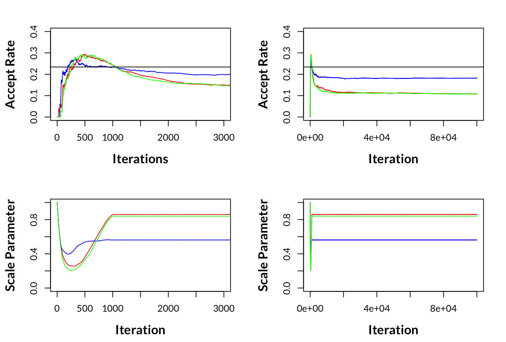

<figure>
  
  <figcaption>Generated with DALL-E</figcaption>
</figure>
<!--
> [!warning] Advisory to Reader
> This Post Assumes a basic knowledge of multiple regression, a limited exposure to probability and statistical theory, as well as coding in R
-->


## But first, What is Bayesian Statistics?

If not already clear, Markov Chain Monte Carlo (MCMC) is a tool for implementing Bayesian analyses. Pardon me? If that doesn't make sense, please stay with me; otherwise, please skip ahead. 

> Bayesian statistics is just an alternative paradigm to how students are usually first taught statistics, called *Frequentist Statistics*. 

While some might debate you on this, a common perspective is that neither Bayesian nor Frequentist statistics is necessarily better; what's most important is one recognizes that they are different in implementation but, more importantly, different in their philosophy, the nuances of which will not be covered here. While Frequentist vs Bayesian Statistics is an important discussion, it is also not something you can knock out in 5 minutes. For an extremely brief comparison, see the table below on the difference in Frequentist vs. Bayesian statistics.


&nbsp;

<!DOCTYPE html>
<html>
<head>
    <title>Comparison Table</title>
    <style>
        table {
            margin-left: auto;
            margin-right: auto;
            width: 80%;
            border-collapse: collapse;
            font-size: 12.5px;
        }
        th, td {
            text-align: left;
            padding: 5px;
        }
        caption {
            caption-side: top; /* Caption position: top or bottom */
            font-size: 18px; /* Adjust caption font size as needed */
            font-weight: bold; /* Optional: makes the caption text bold */
            padding: 5px; /* Optional: adds padding around the caption */
        }
    </style>
</head>
<body>

<table border="1">
  <caption>Bayesian vs. Frequentist Statistics</caption>
  <colgroup>
    <col style="width: 20%;">
    <col style="width: 40%;">
    <col style="width: 40%;">
  </colgroup>
  <tr>
    <th></th>
    <th>Frequentist</th>
    <th>Bayesian</th>
  </tr>
  <tr>
    <td>Answer given</td>
    <td>Probability of the observed data given an underlying truth</td>
    <td>Probability of the truth given the observed data</td>
  </tr>
  <tr>
    <td>Population parameter</td>
    <td>Fixed, but unknown</td>
    <td>Prob. distribution of values</td>
  </tr>
  <tr>
    <td>Outcome measure</td>
    <td>Probability of extreme results, assuming null hypothesis (P value)</td>
    <td>Posterior probability of the hypothesis</td>
  </tr>
  <tr>
    <td>Weaknesses</td>
    <td>Logical inconsistency with clinical decision-making</td>
    <td>Subjectivity in priors' choice; complexity in PKPD modeling</td>
  </tr>
  <tr>
    <td>Strengths</td>
    <td>No need for priors; well-known methods</td>
    <td>Consistency with clinical decision-making</td>
  </tr>
  <tr>
    <td>PKPD application</td>
    <td>Good estimates with large data</td>
    <td>Adaptation of data to individuals</td>
  </tr>
</table>

</body>
</html>

**(Introna, Michele, et al, 2022)**[^2] 

&nbsp;

## What is MCMC?

MCMC -  for the sake of keeping things simple - is a means of sampling a target distribution to arrive at empirical posterior marginal distributions for our parameters of interest, where the target distribution is the distribution that we assume the population response to be following. What's Notable about MCMC is that it does not require an envelope to sample the target distribution due to the Markov property. In addition, with MCMC, we can arrive at empirical posterior marginal distributions for the parameters of interest without needing conjugate priors. 

Practically, this means there is ample software people can use to do Bayesian analysis using MCMC without needing to know the statistical theory that allows for it to work in the first place. With regard to reducing barriers to entry, this is a big deal! However, understanding how algorithms work is crucial! It helps data scientists make informed decisions about the choice of models and algorithms, ensuring the robustness and accuracy of their analyses. Moreover, Understanding the underlying mechanics of MCMC also aids in diagnosing convergence issues and interpreting the results correctly. 

**Now, on with the post!**

&nbsp;

> [!abstract] Agenda
>
> The purpose of this post is to demonstrate how to implement the Metropolis-Hastings MCMC algorithm from scratch for a multiple linear regression. 

The First implementation will be designated implementation **(a)**; after that, I will add more complexity but also realism in implementations **(b)** through to **(c)**,  mirroring something closer to canned software such as Jags and BUGS. Let's break down some of the first steps.

&nbsp;
## MCMC Outline 

1. Sample a candidate value $\mathbf{X}^*$ from a proposal distribution $g\left(\cdot \mid \mathbf{x}^{(t)}\right)$.
2. Compute the Metropolis-Hastings ratio $R\left(\mathrm{x}^{(t)}, \mathbf{X}^*\right)$, where
$$
R(\mathbf{u}, \mathbf{v})=\frac{f(\mathbf{v}) g(\mathbf{u} \mid \mathbf{v})}{f(\mathbf{u}) g(\mathbf{v} \mid \mathbf{u})} .
$$

Note that $R\left(\mathrm{x}^{(t)}, \mathbf{X}^*\right)$ is always defined, because the proposal $\mathbf{X}^*=\mathrm{x}^*$ can only occur if $f\left(\mathrm{x}^{(t)}\right)>0$ and $g\left(\mathrm{x}^* \mid \mathrm{x}^{(t)}\right)>0$.
3. Sample a value for $\mathbf{X}^{(t+1)}$ according to the following:
$$
\mathbf{X}^{(t+1)}= \begin{cases}\mathbf{X}^* & \text { with probability } \min \left\{R\left(\mathbf{x}^{(t)}, \mathbf{X}^*\right), 1\right\}, \\ \mathbf{x}^{(t)} & \text { otherwise. }\end{cases}
$$
4. Increment $t$ and return to step 1.

**(Givens and Hoeting, 2006)**[^1]

&nbsp;
## Writing our first MCM for implementation (a)
1. Read in Data
2. Write our own Sample Function 
3. Specify Likelihood Function 
4. Use Optimisation to Get Starting Values
5. Specify Prior Function 
6. Specify Posterior Function

Once these five steps are completed, we can begin to write the MCMC algorithm. 

<a name="#1-reading-in-the-data"></a>
### 1. Reading in the Data
```r
dat = read.csv("data/bodyfat.csv");n = nrow(dat)
y = dat[,1]; X = as.matrix(cbind(Int = rep(1,n),dat[,-1]))
p = ncol(X); ee = 1e-16 
```

&nbsp;

The data is on the percent body fat for 252 adult males, where the objective is to describe 13 simple body measurements in a multiple regression model; the data was collected from **Lohman, T, 1992**[^3] .


<!DOCTYPE html>
<html>
<body>
<head>
<style>
 table.ExtraPadRight {
    margin-left: auto;
    margin-right: auto;
    width: 95%;
    border-collapse: separate;
    border-spacing: 0px 0;
    table-layout: fixed;
  }

  .ExtraPadRight th, .ExtraPadRight td {
    text-align: center; /* Align text to the center */
    padding: 5px 10px;
    font-size: 14.5px;
    width: 50%; 
  }
</style>
</head>
<body>
<table class = "ExtraPadRight">
<caption>Potential Predictors of Body Fat - Data from Lohman, T, 1992</caption>
<tbody>
  <tr>
    <td>1. Age (years)</td>
    <td>8. Thigh (cm)</td>
  </tr>
  <tr>
    <td>2. Weight (pounds)</td>
    <td>9. Knee (cm)</td>
  </tr>
  <tr>
    <td>3. Height (inches)</td>
    <td>10. Ankle (cm)</td>
  </tr>
  <tr>
    <td>4. Neck (cm)</td>
    <td>11. Extended biceps (cm)</td>
  </tr>
  <tr>
    <td>5. Chest (cm)</td>
    <td>12. Forearm (cm)</td>
  </tr>
  <tr>
    <td>6. Abdomen (cm)</td>
    <td>13. Wrist (cm)</td>
  </tr>
  <tr>
    <td>7. Hip (cm)</td>
    <td></td> 
  </tr>
</tbody>
</table>

</body>
</html>


### 2. Write our own Sample Function 

Later, we will need a function to summarise the results from the posterior distributions, see `samp.o`.

```r
samp.o <- function(t.s) {
  round(
    c(mean = mean(t.s),
      sd = sd(t.s),
      lower = quantile(t.s, 0.025, names = F),
      upper = quantile(t.s, 0.975, names = F)), digits = 6)
}
```

Now we have our data, we need to specify a Likelihood Function.

&nbsp;
### 3. Specify Log-Likelihood Function 

Because we have a numerical response, it is reasonable to assume that our population resposne is normally distributed:

$$
Y \sim \text{N}(\mu, \sigma^2)
$$

Note, that we are using Log Likelihood for numerical precision. 

```r
llike <- function(pars) {
  beta <- pars[1:(length(pars)-1)]
  sigma_sq <- max(pars[(length(pars))],ee)
  sum(log(dnorm(y, mean = X %*% beta, sd = sqrt(sigma_sq))))}
```

Next, we need to get estimates to use as our starting values as MCMC is sent to where they start chains for each parameter. 

&nbsp;
### 4. Use Optimisation to Get Starting Values
```r
par0 = c(mean(y),rep(0,p-1),3)
opt <- optim(par = par0,fn = llike,method = "BFGS",
             hessian = TRUE,control = list(fnscale=-1))
np <- length(opt$par)
opt$par
```


<!DOCTYPE html>
<html>
<head>
<style>
  .opt td {
    border-top: 2px solid #57B9E9;
    text-align: left;
    font-size: 15px; /* Adjust this value to change the font size of table data */
  }
  .opt th {
    text-align: right; /* Style for headers */
    font-size: 14.5px; /* Adjust this value to change the font size of headers */
  }
</style>
</head>
<body>
<table class="opt">
<thead>
  <tr>
    <th>beta_0</th>
    <th>beta_1</th>
    <th>beta_2</th>
    <th>beta_3</th>
    <th>beta_4</th>
    <th>beta_5</th>
    <th>beta_6</th>
    <th>beta_7</th>
    <th>beta_8</th>
    <th>beta_9</th>
    <th>beta_10</th>
    <th>beta_11</th>
    <th>beta_12</th>
    <th>beta_13</th>
    <th>sigma_sq</th>
  </tr>
</thead>
<tbody>
  <tr>
   <td style="text-align:right;"> -17.8 </td>
   <td style="text-align:right;"> 0.057 </td>
   <td style="text-align:right;"> -0.086 </td>
   <td style="text-align:right;"> -0.037 </td>
   <td style="text-align:right;"> -0.43 </td>
   <td style="text-align:right;"> -0.018 </td>
   <td style="text-align:right;"> 0.89 </td>
   <td style="text-align:right;"> -0.196 </td>
   <td style="text-align:right;"> 0.236 </td>
   <td style="text-align:right;"> -0.021 </td>
   <td style="text-align:right;"> 0.167 </td>
   <td style="text-align:right;"> 0.157 </td>
   <td style="text-align:right;"> 0.429 </td>
   <td style="text-align:right;"> -1.47 </td>
   <td style="text-align:right;"> 15.1 </td>
  </tr>
</tbody>
</table>
</html>

> [!note] Note
>
> These estimates are very similar to what you get with `coef(lm(y ~ ., data = dat))`

&nbsp;

### 5. Specify Prior Function 

Using the Jeffreys prior (an improper prior), we can implement a Random Walk Chain with Metropolis-Hastings Markov Chain Monte Carlo to sample the Normal target distribution where Jeffreys prior is defined as 

$$
f\left(\underline{\beta}, \sigma^2\right) \propto 1 / \sigma^2
$$

which we can write in code simply as 

```r
lprior <- function(pars) {sigma_sq = max(pars[np],ee); log(1 /(sigma_sq))}
```

&nbsp;

### 5. Specify Posterior Function

The Posterior distribution is defined as 
$$
f(\underline{\theta} \mid y)=\frac{L(\underline{\theta} \mid y) f(\underline{\theta})}{\int_0^{\infty} L(\underline{\theta} \mid y) f(\underline{\theta}) d \underline{\theta}} \propto L(\underline{\theta} \mid y) f(\underline{\theta})
$$

where the posterior is simply the prior times the likelihood, while on a log scale, it is simply addition, hence: 

```r
lpost <- function(pars) llike(pars) + lprior(pars)
```

<a name="implementation-a"></a> 
## Implementation (a)


We will start off with a simpler implementation, which we will denote [Implementation (a)](#implementation-a) with manual scaling, Single Chain, Burn-in, No thinning,  and a Jeffrey's Prior.

First, I will present the code and then explain the details see the foldable code chunk **(a)**, below:

> [!info]- (a): manual scaling, Single Chain, Burn-in, No thinning,  and a Jeffrey's Prior
> ```r
> library(mvtnorm)
> np <- length(opt$par)
> lprior <- function(pars) {sigma_sq = max(pars[np],ee); log(1 /(sigma_sq))}
> lpost <- function(pars) llike(pars) + lprior(pars)
> n.s = 100000; draws = matrix(NA, n.s, np)
> draws[1, ] = opt$par; C = -solve(opt$hessian)
> scale_par = .45; burnin = 500; set.seed(23) 
> for (t in 2:n.s) {
>   u = runif(1) 
>   prop <- rmvnorm(1, mean = draws[t-1, ], sigma = scale_par*C)
>   if (u < exp(lpost(prop) - lpost(draws[t-1,]))) { # acceptance ratio
>     draws[t, ] = prop # accept #
>   } else { 
>     draws[t, ] = draws[t -1, ] }} # reject #
> tab.MCMC.a <- t(apply(X=draws[-c(1:burnin),],MARGIN = 2,FUN = samp.o))
> row.names(tab.MCMC.a) <- par_names; tab.MCMC.a
> (acc.a = (apply(draws[-c(1:burnin),],2,function(x) length(unique(x))/length(x)))[1])
> ```

To start, [Implementation (a)](#implementation-a) uses Jeffrey's Prior, which is an improper, vague prior; it is improper because its integral does not sum to 1, which is a requirement for valid PDFs.  However, its density function is proportional to the square root of the determinant of the Fisher information matrix:

$$
p(\vec{\theta}) \propto \sqrt{\operatorname{det} \mathcal{I}(\vec{\theta})}
$$

As already stated, Jeffrey's Prior is vague prior, which is also known as a flat, or non-informative prior. Vague priors are guaranteed to play a minimal role in the posterior distribution. 

We are using the multivariate normal distribution with `rmvnorm` to generate proposal values for each of the parameters, and scaling the variance covariance matrix `C` by  `scale_par` to help adjust the acceptance ratio towards the optimal acceptance rate of 23.4 that holds for inhomogeneous target distributions $\pi\left(x^{(d)}\right)=\Pi_{i=1}^d C_i f\left(C_i x_i\right)$ (Roberts and Rosenthal, 2001)[^4].

For [Implementation (a)](#implementation-a), we get an acceptance ratio of `0.2267`; this was achieved in part by manually choosing `scale_par` to get an acceptance ratio closer to the target of 0.234. 

Below, we can print our results

```r
tab.MCMC.a
```

<!DOCTYPE html>
<html>
<head>
<style>
 table.ExtraPadRight {
    margin-left: auto;
    margin-right: auto;
    width: 95%;
    border-collapse: separate;
    border-spacing: 0px 0;
    table-layout: fixed;
  }

  .ExtraPadRight th, .ExtraPadRight td {
    text-align: center; /* Align text to the center */
    padding: 5px 10px;
    font-size: 14.5px;
    width: 50%; 
  }
</style>
</head>
<body>
<table class = "ExtraPadRight"><thead>
  <tr>
   <th style="text-align:left;"> Parameters</th>
   <th style="text-align:right;"> Mean </th>
   <th style="text-align:right;"> SD </th>
   <th style="text-align:right;"> Lower </th>
   <th style="text-align:right;"> Upper </th>
  </tr>
 </thead>
<tbody>
  <tr>
   <td style="text-align:left;"> beta_0 </td>
   <td style="text-align:right;"> -18.043 </td>
   <td style="text-align:right;"> 20.961 </td>
   <td style="text-align:right;"> -58.974 </td>
   <td style="text-align:right;"> 23.104 </td>
  </tr>
  <tr>
   <td style="text-align:left;"> beta_1 </td>
   <td style="text-align:right;"> 0.057 </td>
   <td style="text-align:right;"> 0.031 </td>
   <td style="text-align:right;"> -0.003 </td>
   <td style="text-align:right;"> 0.118 </td>
  </tr>
  <tr>
   <td style="text-align:left;"> beta_2 </td>
   <td style="text-align:right;"> -0.087 </td>
   <td style="text-align:right;"> 0.058 </td>
   <td style="text-align:right;"> -0.200 </td>
   <td style="text-align:right;"> 0.029 </td>
  </tr>
  <tr>
   <td style="text-align:left;"> beta_3 </td>
   <td style="text-align:right;"> -0.035 </td>
   <td style="text-align:right;"> 0.166 </td>
   <td style="text-align:right;"> -0.356 </td>
   <td style="text-align:right;"> 0.290 </td>
  </tr>
  <tr>
   <td style="text-align:left;"> beta_4 </td>
   <td style="text-align:right;"> -0.431 </td>
   <td style="text-align:right;"> 0.222 </td>
   <td style="text-align:right;"> -0.868 </td>
   <td style="text-align:right;"> 0.009 </td>
  </tr>
  <tr>
   <td style="text-align:left;"> beta_5 </td>
   <td style="text-align:right;"> -0.015 </td>
   <td style="text-align:right;"> 0.096 </td>
   <td style="text-align:right;"> -0.201 </td>
   <td style="text-align:right;"> 0.175 </td>
  </tr>
  <tr>
   <td style="text-align:left;"> beta_6 </td>
   <td style="text-align:right;"> 0.889 </td>
   <td style="text-align:right;"> 0.085 </td>
   <td style="text-align:right;"> 0.719 </td>
   <td style="text-align:right;"> 1.052 </td>
  </tr>
  <tr>
   <td style="text-align:left;"> beta_7 </td>
   <td style="text-align:right;"> -0.194 </td>
   <td style="text-align:right;"> 0.139 </td>
   <td style="text-align:right;"> -0.470 </td>
   <td style="text-align:right;"> 0.075 </td>
  </tr>
  <tr>
   <td style="text-align:left;"> beta_8 </td>
   <td style="text-align:right;"> 0.241 </td>
   <td style="text-align:right;"> 0.138 </td>
   <td style="text-align:right;"> -0.026 </td>
   <td style="text-align:right;"> 0.512 </td>
  </tr>
  <tr>
   <td style="text-align:left;"> beta_9 </td>
   <td style="text-align:right;"> -0.025 </td>
   <td style="text-align:right;"> 0.234 </td>
   <td style="text-align:right;"> -0.492 </td>
   <td style="text-align:right;"> 0.433 </td>
  </tr>
  <tr>
   <td style="text-align:left;"> beta_10 </td>
   <td style="text-align:right;"> 0.166 </td>
   <td style="text-align:right;"> 0.212 </td>
   <td style="text-align:right;"> -0.251 </td>
   <td style="text-align:right;"> 0.585 </td>
  </tr>
  <tr>
   <td style="text-align:left;"> beta_11 </td>
   <td style="text-align:right;"> 0.155 </td>
   <td style="text-align:right;"> 0.162 </td>
   <td style="text-align:right;"> -0.162 </td>
   <td style="text-align:right;"> 0.470 </td>
  </tr>
  <tr>
   <td style="text-align:left;"> beta_12 </td>
   <td style="text-align:right;"> 0.429 </td>
   <td style="text-align:right;"> 0.187 </td>
   <td style="text-align:right;"> 0.068 </td>
   <td style="text-align:right;"> 0.805 </td>
  </tr>
  <tr>
   <td style="text-align:left;"> beta_13 </td>
   <td style="text-align:right;"> -1.484 </td>
   <td style="text-align:right;"> 0.509 </td>
   <td style="text-align:right;"> -2.490 </td>
   <td style="text-align:right;"> -0.498 </td>
  </tr>
  <tr>
   <td style="text-align:left;"> sigma_sq </td>
   <td style="text-align:right;"> 16.156 </td>
   <td style="text-align:right;"> 1.476 </td>
   <td style="text-align:right;"> 13.479 </td>
   <td style="text-align:right;"> 19.295 </td>
  </tr>
</tbody>
</table>
</body>
</html>

> [!tip] Reminder
> 
>  The posterior distribution is what we get out of a Bayesian analysis; we get one distribution for each parameter. Hence see <a href="#plotly-weight-histogram">beta_3 Posterior</a> below.

Thus, We can plot the posterior distribution for Weight ($\beta_3$), in which case we can see that the mode of the distribution is similar to the mean point estimate presented in the table above (-0.036). 


<iframe id="plotly-weight-histogram" src="https://chart-studio.plotly.com/~dhintz1/4/#/" width="640"
height="480" frameborder="0" allowfullscreen></iframe>

Next in [Implementation (b)](#implementation-b), instead of using a Jeffries Prior, we can create `priors_list`, and specify a prior for each parameter. 

<a name="implementation-b"></a> 
## Implementation (b)

> [!info]- (b):  Manual scaling, Single chain, Burn-in, No thinning, Uniform and Normal priors
> ```r
> priors_list <- list(
>   function(theta) dnorm(theta, mean = 0, sd = 1000, log = TRUE),  # beta_0 Prior
>   function(theta) dnorm(theta, mean = 0, sd = 1000, log = TRUE),  # beta_1 Prior 
>   function(theta) dnorm(theta, mean = 0, sd = 1000, log = TRUE),  # beta_2 Prior 
>   function(theta) dnorm(theta, mean = 0, sd = 1000, log = TRUE),  # beta_3 Prior 
>   function(theta) dnorm(theta, mean = 0, sd = 1000, log = TRUE),  # beta_4 Prior
>   function(theta) dnorm(theta, mean = 0, sd = 1000, log = TRUE),  # beta_5 Prior
>   function(theta) dnorm(theta, mean = 0, sd = 1000, log = TRUE),  # beta_6 Prior
>   function(theta) dnorm(theta, mean = 0, sd = 1000, log = TRUE),  # beta_7 Prior
>   function(theta) dnorm(theta, mean = 0, sd = 1000, log = TRUE),  # beta_8 Prior
>   function(theta) dnorm(theta, mean = 0, sd = 1000, log = TRUE),  # beta_9 Prior
>   function(theta) dnorm(theta, mean = 0, sd = 1000, log = TRUE),  # beta_10 Prior
>   function(theta) dnorm(theta, mean = 0, sd = 1000, log = TRUE),  # beta_11 Prior
>   function(theta) dnorm(theta, mean = 0, sd = 1000, log = TRUE),  # beta_12 Prior
>   function(theta) dnorm(theta, mean = 0, sd = 1000, log = TRUE),  # beta_13 Prior
>   function(theta) dunif(theta, min = 1e-6, max = 40,  log = TRUE) # sigma_sq Prior
> )
> # Function to calculate the total log prior
> log_prior_func <- function(theta, priors_list) {
>   log_prior_values <- mapply(function(theta_val, prior_func) prior_func(theta_val), theta, priors_list)
>   sum(log_prior_values)
> }
> # Modify lprior to use the log_prior_func
> lprior <- function(pars) log_prior_func(pars, priors_list)
> # Modify lpost to include the new lprior
> lpost <- function(pars) llike(pars) + lprior(pars)
> for (t in 2:n.s) {
>   u = runif(1) 
>   prop <- rmvnorm(1, mean = draws[t-1, ], sigma = scale_par*C)
>   if (u < exp(lpost(prop) - lpost(draws[t-1,]))) { # acceptance ratio
>     draws[t, ] = prop # accept #
>   } else { 
>     draws[t, ] = draws[t -1, ] }} # reject #
> tab.MCMC.b <- t(apply(X=draws[-c(1:burnin),],MARGIN = 2,FUN = samp.o))
> row.names(tab.MCMC.b) <- par_names; tab.MCMC.b
> (acc.b = (apply(draws[-c(1:burnin),],2,function(x) length(unique(x))/length(x)))[1])
> ```

Notice we print a summary table of the posterior distributions, the point estimates we get our different from [Implementation (a)](#implementation-a). Note, we also get a different acceptance rate of `0.227`.

```r
tab.MCMC.b
```


<!DOCTYPE html>
<html>
<head>
<style>
 table.ExtraPadRight {
    margin-left: auto;
    margin-right: auto;
    width: 95%;
    border-collapse: separate;
    border-spacing: 0px 0;
    table-layout: fixed;
  }

  .ExtraPadRight th, .ExtraPadRight td {
    text-align: center; /* Align text to the center */
    padding: 5px 10px;
    font-size: 14.5px;
    width: 50%; 
  }
</style>
</head>
<body>
<table class="ExtraPadRight"><thead>
  <tr>
   <th style="text-align:left;"> Parameters</th>
   <th style="text-align:right;"> Mean </th>
   <th style="text-align:right;"> SD </th>
   <th style="text-align:right;"> Lower </th>
   <th style="text-align:right;"> Upper </th>
  </tr>
 </thead>
<tbody>
  <tr>
   <td style="text-align:left;"> beta_0 </td>
   <td style="text-align:right;"> -17.891 </td>
   <td style="text-align:right;"> 20.698 </td>
   <td style="text-align:right;"> -57.690 </td>
   <td style="text-align:right;"> 23.028 </td>
  </tr>
  <tr>
   <td style="text-align:left;"> beta_1 </td>
   <td style="text-align:right;"> 0.056 </td>
   <td style="text-align:right;"> 0.030 </td>
   <td style="text-align:right;"> -0.003 </td>
   <td style="text-align:right;"> 0.116 </td>
  </tr>
  <tr>
   <td style="text-align:left;"> beta_2 </td>
   <td style="text-align:right;"> -0.086 </td>
   <td style="text-align:right;"> 0.058 </td>
   <td style="text-align:right;"> -0.197 </td>
   <td style="text-align:right;"> 0.028 </td>
  </tr>
  <tr>
   <td style="text-align:left;"> beta_3 </td>
   <td style="text-align:right;"> -0.037 </td>
   <td style="text-align:right;"> 0.167 </td>
   <td style="text-align:right;"> -0.363 </td>
   <td style="text-align:right;"> 0.289 </td>
  </tr>
  <tr>
   <td style="text-align:left;"> beta_4 </td>
   <td style="text-align:right;"> -0.435 </td>
   <td style="text-align:right;"> 0.222 </td>
   <td style="text-align:right;"> -0.871 </td>
   <td style="text-align:right;"> -0.005 </td>
  </tr>
  <tr>
   <td style="text-align:left;"> beta_5 </td>
   <td style="text-align:right;"> -0.017 </td>
   <td style="text-align:right;"> 0.098 </td>
   <td style="text-align:right;"> -0.208 </td>
   <td style="text-align:right;"> 0.176 </td>
  </tr>
  <tr>
   <td style="text-align:left;"> beta_6 </td>
   <td style="text-align:right;"> 0.891 </td>
   <td style="text-align:right;"> 0.084 </td>
   <td style="text-align:right;"> 0.726 </td>
   <td style="text-align:right;"> 1.055 </td>
  </tr>
  <tr>
   <td style="text-align:left;"> beta_7 </td>
   <td style="text-align:right;"> -0.195 </td>
   <td style="text-align:right;"> 0.138 </td>
   <td style="text-align:right;"> -0.469 </td>
   <td style="text-align:right;"> 0.075 </td>
  </tr>
  <tr>
   <td style="text-align:left;"> beta_8 </td>
   <td style="text-align:right;"> 0.233 </td>
   <td style="text-align:right;"> 0.138 </td>
   <td style="text-align:right;"> -0.041 </td>
   <td style="text-align:right;"> 0.498 </td>
  </tr>
  <tr>
   <td style="text-align:left;"> beta_9 </td>
   <td style="text-align:right;"> -0.020 </td>
   <td style="text-align:right;"> 0.232 </td>
   <td style="text-align:right;"> -0.472 </td>
   <td style="text-align:right;"> 0.433 </td>
  </tr>
  <tr>
   <td style="text-align:left;"> beta_10 </td>
   <td style="text-align:right;"> 0.171 </td>
   <td style="text-align:right;"> 0.207 </td>
   <td style="text-align:right;"> -0.231 </td>
   <td style="text-align:right;"> 0.575 </td>
  </tr>
  <tr>
   <td style="text-align:left;"> beta_11 </td>
   <td style="text-align:right;"> 0.159 </td>
   <td style="text-align:right;"> 0.162 </td>
   <td style="text-align:right;"> -0.155 </td>
   <td style="text-align:right;"> 0.474 </td>
  </tr>
  <tr>
   <td style="text-align:left;"> beta_12 </td>
   <td style="text-align:right;"> 0.432 </td>
   <td style="text-align:right;"> 0.188 </td>
   <td style="text-align:right;"> 0.053 </td>
   <td style="text-align:right;"> 0.797 </td>
  </tr>
  <tr>
   <td style="text-align:left;"> beta_13 </td>
   <td style="text-align:right;"> -1.480 </td>
   <td style="text-align:right;"> 0.499 </td>
   <td style="text-align:right;"> -2.459 </td>
   <td style="text-align:right;"> -0.499 </td>
  </tr>
  <tr>
   <td style="text-align:left;"> sigma_sq </td>
   <td style="text-align:right;"> 16.226 </td>
   <td style="text-align:right;"> 1.465 </td>
   <td style="text-align:right;"> 13.655 </td>
   <td style="text-align:right;"> 19.338 </td>
  </tr>
</tbody>
 </table>
 </body>
</html>

The next layers of complexity we will add for [Implementation (c)](#implementation-c) are thinning, multiple chains, and Adaptive Scaling. 

<a name="implementation-c"></a> 
## Implementation (c) 

> [!info]- (c): LR Adaptive Scaling, n-chain, Burn-in, Thinning, Jeffrey's Prior
> ```r
> mh.mcmc.c <- function(n.s, start.p, start.hessian, burnin, seed = 23, initial_scale_par = 1, n.chain = 3, thinning = 1, par_names = NULL, learning_rate = 0.05, target_acc_rate = 0.234, target_range = 0.01, Adapt = TRUE){
>   np <- length(start.p)
>   set.seed(seed) 
>   
>   chains <- list()
>   scale_par_history <- vector("list", n.chain) # List to store scale_par history for each chain
>   accept_rate_history <- vector("list", n.chain)
>   
>   
>   for (j in 1:n.chain){
>     chain_draws = matrix(NA, n.s, np)
>     chain_draws[1, ] = start.p
>     acc_count = 0 # Initialize acc_count
>     scale_par <- initial_scale_par # Initialize scale parameter for each chain
>     C = -solve(start.hessian) * scale_par # Scale the covariance matrix
>     scale_par_vec <- numeric(n.s) 
>     accept_rate_vec <- numeric(n.s)
>     scale_par_vec[1] <- scale_par
>     
>     for (t in 2:n.s) {
>       u = runif(1) 
>       prop <- rmvnorm(1, mean = chain_draws[t-1, ], sigma = C)
>       accept_ratio = exp(lpost(prop) - lpost(chain_draws[t-1,]))
>       if (u < accept_ratio) {
>         chain_draws[t, ] = prop # accept
>           acc_count <- acc_count + 1
>       } else { 
>         chain_draws[t, ] = chain_draws[t -1, ] # reject
>       }
>       
>       current_acc_rate = acc_count / (t) 
>       # Adapt scale_par during burn-in
>       if ((t <= burnin) && Adapt) {
>         if (
>           # if under or over shooting target_range
>           !((abs(target_acc_rate - current_acc_rate) >= 0 &&
>              (abs(target_acc_rate - current_acc_rate)) <= target_range)) 
>           ){ # then update scale_par
>           scale_par <- scale_par * exp(learning_rate * (current_acc_rate - target_acc_rate))
>           C = -solve(start.hessian) * scale_par
>         } 
>       }
>       accept_rate_vec[t] <- current_acc_rate 
>       scale_par_vec[t] <- scale_par
>     }
>     
>     accept_rate_history[[j]] <- accept_rate_vec
>     scale_par_history[[j]] <- scale_par_vec 
>     
>     # Thinning and removing burn-in samples
>     chains[[j]] <- chain_draws[(burnin+1):n.s,][seq(1, n.s - burnin, thinning),]
>     
>     if(!is.null(par_names)){
>       colnames(chains[[j]]) <- par_names
>     }
>   }
>   
>   tab <- t(apply(X=do.call(rbind, chains),MARGIN = 2,FUN = samp.o))
>   final_acceptance_rates <- sapply(accept_rate_history, function(x) tail(x,1))
>   
>   return(
>     list(chains = chains,
>          tab = tab, 
>          final_acceptance_rates = final_acceptance_rates,
>          scale_par_history = scale_par_history,
>          accept_rate_history = accept_rate_history))
> }
> set.seed(23)
> burnin <- 1000
> mcmc.c <- mh.mcmc.c(n.s = n.s, start.p = opt$par, start.hessian = opt$hessian, burnin = burnin, initial_scale_par = 1, n.chain = 3, thinning = 20, target_range = 0.0005)
> ```

```r
mcmc.c$tab
```

<!DOCTYPE html>
<html>
<head>
<style>
 table.ExtraPadRight {
    margin-left: auto;
    margin-right: auto;
    width: 95%;
    border-collapse: separate;
    border-spacing: 0px 0;
    table-layout: fixed;
  }

  .ExtraPadRight th, .ExtraPadRight td {
    text-align: center; /* Align text to the center */
    padding: 5px 10px;
    font-size: 14.5px;
    width: 50%; 
  }
</style>
</head>
<body>
<table class = "ExtraPadRight"><thead>
  <tr>
   <th style="text-align:left;">Parameters</th>
   <th style="text-align:right;"> Mean </th>
   <th style="text-align:right;"> SD </th>
   <th style="text-align:right;"> Lower </th>
   <th style="text-align:right;"> Upper </th>
  </tr>
 </thead>
<tbody>
  <tr>
   <td style="text-align:left;"> beta_0 </td>
   <td style="text-align:right;"> -17.626 </td>
   <td style="text-align:right;"> 20.845 </td>
   <td style="text-align:right;"> -58.742 </td>
   <td style="text-align:right;"> 23.601 </td>
  </tr>
  <tr>
   <td style="text-align:left;"> beta_1 </td>
   <td style="text-align:right;"> 0.057 </td>
   <td style="text-align:right;"> 0.030 </td>
   <td style="text-align:right;"> -0.002 </td>
   <td style="text-align:right;"> 0.116 </td>
  </tr>
  <tr>
   <td style="text-align:left;"> beta_2 </td>
   <td style="text-align:right;"> -0.085 </td>
   <td style="text-align:right;"> 0.058 </td>
   <td style="text-align:right;"> -0.198 </td>
   <td style="text-align:right;"> 0.028 </td>
  </tr>
  <tr>
   <td style="text-align:left;"> beta_3 </td>
   <td style="text-align:right;"> -0.035 </td>
   <td style="text-align:right;"> 0.167 </td>
   <td style="text-align:right;"> -0.364 </td>
   <td style="text-align:right;"> 0.295 </td>
  </tr>
  <tr>
   <td style="text-align:left;"> beta_4 </td>
   <td style="text-align:right;"> -0.434 </td>
   <td style="text-align:right;"> 0.222 </td>
   <td style="text-align:right;"> -0.875 </td>
   <td style="text-align:right;"> 0.001 </td>
  </tr>
  <tr>
   <td style="text-align:left;"> beta_5 </td>
   <td style="text-align:right;"> -0.018 </td>
   <td style="text-align:right;"> 0.097 </td>
   <td style="text-align:right;"> -0.204 </td>
   <td style="text-align:right;"> 0.177 </td>
  </tr>
  <tr>
   <td style="text-align:left;"> beta_6 </td>
   <td style="text-align:right;"> 0.891 </td>
   <td style="text-align:right;"> 0.083 </td>
   <td style="text-align:right;"> 0.727 </td>
   <td style="text-align:right;"> 1.052 </td>
  </tr>
  <tr>
   <td style="text-align:left;"> beta_7 </td>
   <td style="text-align:right;"> -0.198 </td>
   <td style="text-align:right;"> 0.138 </td>
   <td style="text-align:right;"> -0.469 </td>
   <td style="text-align:right;"> 0.072 </td>
  </tr>
  <tr>
   <td style="text-align:left;"> beta_8 </td>
   <td style="text-align:right;"> 0.236 </td>
   <td style="text-align:right;"> 0.137 </td>
   <td style="text-align:right;"> -0.033 </td>
   <td style="text-align:right;"> 0.502 </td>
  </tr>
  <tr>
   <td style="text-align:left;"> beta_9 </td>
   <td style="text-align:right;"> -0.027 </td>
   <td style="text-align:right;"> 0.231 </td>
   <td style="text-align:right;"> -0.476 </td>
   <td style="text-align:right;"> 0.417 </td>
  </tr>
  <tr>
   <td style="text-align:left;"> beta_10 </td>
   <td style="text-align:right;"> 0.169 </td>
   <td style="text-align:right;"> 0.207 </td>
   <td style="text-align:right;"> -0.236 </td>
   <td style="text-align:right;"> 0.576 </td>
  </tr>
  <tr>
   <td style="text-align:left;"> beta_11 </td>
   <td style="text-align:right;"> 0.156 </td>
   <td style="text-align:right;"> 0.163 </td>
   <td style="text-align:right;"> -0.162 </td>
   <td style="text-align:right;"> 0.478 </td>
  </tr>
  <tr>
   <td style="text-align:left;"> beta_12 </td>
   <td style="text-align:right;"> 0.429 </td>
   <td style="text-align:right;"> 0.188 </td>
   <td style="text-align:right;"> 0.059 </td>
   <td style="text-align:right;"> 0.802 </td>
  </tr>
  <tr>
   <td style="text-align:left;"> beta_13 </td>
   <td style="text-align:right;"> -1.472 </td>
   <td style="text-align:right;"> 0.499 </td>
   <td style="text-align:right;"> -2.462 </td>
   <td style="text-align:right;"> -0.505 </td>
  </tr>
  <tr>
   <td style="text-align:left;"> sigma_sq </td>
   <td style="text-align:right;"> 16.086 </td>
   <td style="text-align:right;"> 1.503 </td>
   <td style="text-align:right;"> 13.408 </td>
   <td style="text-align:right;"> 19.228 </td>
  </tr>
</tbody>
</table>
<body>
</html>

Notice that the point estimate we get from the `samp.o` of our posterior distributions is again different from [Implementation (a)](#implementation-a) and [Implementation (b)](#implementation-b).

<a name="Thinning"></a> 
### Thinning 

Thinning is a process that is done to help reduce the autocorrelation present in the chains; if there is severe autocorrelation, then the results are not usable for inference. Autocorrelation in the chains is usually diagnosed with an autocorrelation plot. Looking at the <a href="#autocorrelation-plot-for-c">Traceplot for (c)</a>, we can see that there is still some concerning autocorrelation (we want almost no spikes for the first half dozen lags); thus, via bumping up the argument `thinning` to be something higher than 20, say 40, we might resolve the issue of autocorrelation. 

```r
old_par <- par()
par(mfrow = c(2,2), mar = c(4.5, 4.5, 2.5, 2),font.lab = 2)
xacf <- list()
for (i in 1:4){
xacf[[i]] <- acf(mcmc.out$chains[[1]][, i], plot = FALSE)
plot(xacf[[i]]$lag,xacf[[i]]$acf, type = "h", xlab = "Lag",ylab = "Autocorrelation", ylim = c(-0.1, 1),cex.lab = 1.3, main = par_names[i], cex.main = 1.5)
}
par(old_par)
```

<figure id="autocorrelation-plot-for-c">
  
  <figcaption><strong>Autocorrelation Plot for (c):</strong> 1 chain, first four parameters</figcaption>
</figure>


<a name="Mixing of Chains"></a> 
### Mixing of Chains 

With adding multiple chains, we have just added an extra loop (in this case, iterating over `j`) to repeat the same sampling procedure for each chain. The traceplots below show good mixing for the first four parameters. If the respective traceplots for each parameter show good mixing of chains, this indicates that the MCMC algorithm converged, and given no problems of autocorrelation, the results are usable for inference.  

<figure id="traceplot-for-c">
  
  <figcaption><strong>Traceplot for (c)</strong>: 3 chains, first four parameters</figcaption>
</figure>


For reference, the image below shows a good mixing of the first chain, indicating convergence, while chain 2 initially shows the chain has not converged until around iteration 1500 and chain 3 never converges. However, a caveat of this plot is that the chains are on different plots. Ideally you want to use a traceplot that shows all chains for a respective parameter on the same plot. Hence, the word mixing is referring  to the fuzzy caterpillar-looking image shown in  <a href="#traceplot-for-c">Traceplot for (c)</a>

<figure>
  
</figure>

**(Taboga, Marco, 2021)**[^5]


&nbsp;

> [!note] Note
>
> If MCMC did not converge, the results are not usable; results are also not usable if there is high autocorrelation shown in the autocorrelation plot.

<a name="Adaptive Scaling"></a> 
### Adaptive Scaling 

Adaptive Scaling is a hand-off approach to adjusting a scaling term (which I named  `scale_par` i the code), which in terms scales the variance-covariance matrix  `C`. The purpose of this scaling is specific to the accept-reject methodology inherent in Metropolis-Hastings MCMC. As there is no knowing what the Acceptance rate will be before running the algorithm as the process is stochastic and is subject to your data, likelihood, and priors. Notice in  [Implementation (a)](#implementation-a) we set `scale_par`, but in practice, this involved rerunning MCMC multiple times adjusting scale_par each run, trying to get an acceptance rate close to the ideal acceptance rate of 0.234. As shown in <a href="#accept-and-scale">MCMC Acceptance Rate Scale Parameter for (c)</a> below, using a learning rate we are able to adjust `scale_par` to get the acceptance rate to hover around 0.234, however, after burnin, while `scale_par` is no longer being adjusted the acceptance rate continues to drift below 0.0234 unit it converges as part of the chains. Hence, adaptive scaling is not perfect, although we can lift the acceptance rate from minuscule digits below 0.001 to above 0.1, we still don't land within a very close distance of the ideal acceptance rate of 0.234. 

<figure id="accept-and-scale">
  
  <figcaption><strong>MCMC Acceptance Rate Scale Parameter:</strong>  iterations 0 to 3000 and 0 to 100000</figcaption>
</figure>

> [!note] Note
>
> A more popular method for Adaptive scaling is Robust Adaptive Metropolis ([RAM](https://cran.r-project.org/web/packages/ramcmc/vignettes/ramcmc.html)). However, to avoid the need for Adaptive Scaling altogether, Gibbs Sampling is another very popular MCMC procedure that uses conditioning to avoid an acceptance rate and, subsequently, the need for Adaptive Scaling.


<!--FOOTNOTES-->
[^1]: [Givens and Hoeting, 2006](https://onlinelibrary.wiley.com/doi/book/10.1002/9781118555552)
[^2]: [Introna, Michele, et al, 2022](https://pubmed.ncbi.nlm.nih.gov/35147768/)
[^3]: [Lohman, T, 1992](https://www.sciepub.com/reference/33145)
[^4]: [Roberts and Rosenthal, 2001](https://www.jstor.org/stable/3182776)
[^5]: [Taboga, Marco, 2021](https://statlect.com/fundamentals-of-statistics/Markov-Chain-Monte-Carlo-diagnostics)