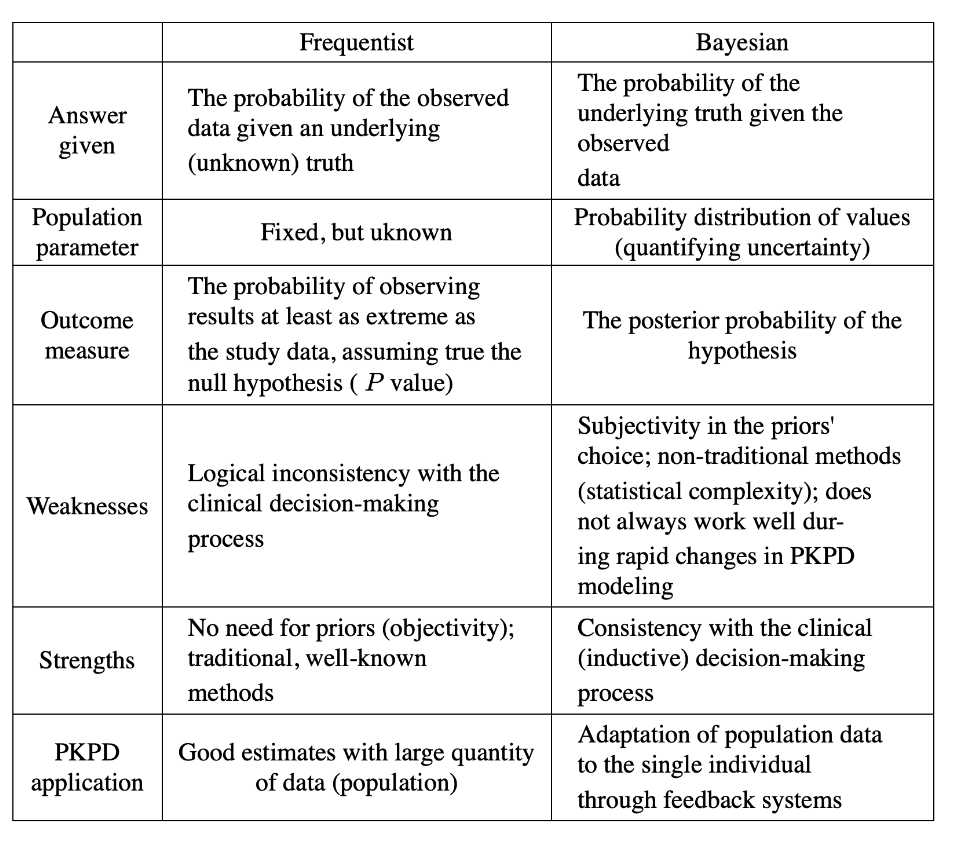

<figure>
  
  <figcaption>Generated with DALL-E</figcaption>
</figure>

### But first, What is Bayesian Statistics?

If not already clear, Markov Chain Monte Carlo (MCMC) is a tool for implementing Bayesian analyses. Pardon me? If that doesn't make sense, please stay with me; otherwise, please skip ahead. 

> Bayesian statistics is just an alternative paradigm to how students are usually first taught statistics, called *Frequentist Statistics*. 

While some might debate you on this, a common perspective is that neither Bayesian nor Frequentist statistics is necessarily better; what's most important is one recognizes that they are different in implementation but, more importantly, different in their philosophy, the nuances of which will not be covered here. While Frequentist vs Bayesian Statistics is an important discussion, it is also not something you can knock out in 5 minutes. For an extremely breif comparsion se the table below on the difference on Frequentist vs Bayesain statistics.

<figure>
  
  <figcaption>Introna, Michele, et al. "Bayesian statistics in anesthesia practice: a tutorial for anesthesiologists." Journal of anesthesia 36.2 (2022): 294-302.</figcaption>
</figure>

<!DOCTYPE html>
<html>
<head>
    <title>Comparison Table</title>
    <style>
        table {
            margin-left: auto;
            margin-right: auto;
            width: 80%;
            border-collapse: collapse;
            font-size: 12.5px;
        }
        th, td {
            text-align: left;
            padding: 5px;
        }
        caption {
            caption-side: top; /* Caption position: top or bottom */
            font-size: 18px; /* Adjust caption font size as needed */
            font-weight: bold; /* Optional: makes the caption text bold */
            padding: 5px; /* Optional: adds padding around the caption */
        }
    </style>
</head>
<body>

<table border="1">
  <caption>Bayesian vs. Frequentist Statistics</caption>
  <colgroup>
    <col style="width: 20%;">
    <col style="width: 40%;">
    <col style="width: 40%;">
  </colgroup>
  <tr>
    <th></th>
    <th>Frequentist</th>
    <th>Bayesian</th>
  </tr>
  <tr>
    <td>Answer given</td>
    <td>Probability of the observed data given an underlying truth</td>
    <td>Probability of the truth given the observed data</td>
  </tr>
  <tr>
    <td>Population parameter</td>
    <td>Fixed, but unknown</td>
    <td>Prob. distribution of values</td>
  </tr>
  <tr>
    <td>Outcome measure</td>
    <td>Probability of extreme results, assuming null hypothesis (P value)</td>
    <td>Posterior probability of the hypothesis</td>
  </tr>
  <tr>
    <td>Weaknesses</td>
    <td>Logical inconsistency with clinical decision-making</td>
    <td>Subjectivity in priors' choice; complexity in PKPD modeling</td>
  </tr>
  <tr>
    <td>Strengths</td>
    <td>No need for priors; well-known methods</td>
    <td>Consistency with clinical decision-making</td>
  </tr>
  <tr>
    <td>PKPD application</td>
    <td>Good estimates with large data</td>
    <td>Adaptation of data to individuals</td>
  </tr>
</table>

</body>
</html>

(Introna, Michele, et al, 2022)[^1] 

&nbsp;

**Now on with the post!**

> [!abstract] Agenda
>
> The purpose of this post is to demonstrate how to implement the Metropolis-Hastings MCMC algorithm from scratch, using Jeffries prior for a simple linear model. 

Let's break down some of the first steps.
### Lead up to writing the Metropolis Hastings MCMC Algorithem
1. Read in Data
2. Specify Likilihood Function 
3. Use Optimation to Get Starting Values
4. Specify Prior Function 
5. Specify Posterior Function

After which we can begin to write the MCMC algorithm. 

### Read in Data
```r
dat = read.csv("data/bodyfat.csv");n = nrow(dat)
y = dat[,1]; X = as.matrix(cbind(Int = rep(1,n),dat[,-1]))
p = ncol(X); ee = 1e-16 
```

The data we are using is from **Lohman, T, 1992**[^1] 

```r
samp.o <- function(t.s) {
  round(
    c(mean = mean(t.s),
      sd = sd(t.s),
      lower = quantile(t.s, 0.025, names = F),
      upper = quantile(t.s, 0.975, names = F)), digits = 6)
}
```

### Specify Likilihood Function 
```r
llike <- function(pars) {
  beta <- pars[1:(length(pars)-1)]
  sigma_sq <- max(pars[(length(pars))],ee)
  sum(log(dnorm(y, mean = X %*% beta, sd = sqrt(sigma_sq))))}
```

### Use Optimation to Get Starting Values
```r
par0 = c(mean(y),rep(0,p-1),3)
opt <- optim(par = par0,fn = llike,method = "BFGS",
             hessian = TRUE,control = list(fnscale=-1))
np <- length(opt$par)
```

### Specify Prior Function 
```r
lprior <- function(pars) {sigma_sq = max(pars[np],ee); log(1 /(sigma_sq))}
```

### Specify Prior Function 

```r
lpost <- function(pars) llike(pars) + lprior(pars)
```

### Finally, we can write the MCMC function 

See mh.mcmc.R below

> [!info]- mh.mcmc.R
> ```r
> library(mvtnorm)
> mh.mcmc <- function(
>   n.s, start.p, start.hessian, burnin, seed = 23, initial_scale_par = 1,
>   n.chain = 3, thinning = 1, par_names = NULL, target_acc_rate = 0.234,
>   learning_rate = 0.05){
>   np <- length(start.p)
>   draws = matrix(NA, n.s, np)
>   scale_par <- initial_scale_par # Initialize scale parameter
>   set.seed(seed) 
>   
>   chains <- list()
>   scale_par_vec <- c()
>   for (j in 1:n.chain){
>     chain_draws = matrix(NA, n.s, np)
>     chain_draws[1, ] = start.p
>     acc_count = 0 # To count the number of acceptances
>     C = -solve(start.hessian) * scale_par # Scale the covariance matrix
>     
>     for (t in 2:n.s) {
>       u = runif(1) 
>       prop <- rmvnorm(1, mean = chain_draws[t-1, ], sigma = C)
>       if (u < exp(lpost(prop) - lpost(chain_draws[t-1,]))) { # acceptance ratio
>         chain_draws[t, ] = prop # accept
>         acc_count <- acc_count + 1
>       } else { 
>         chain_draws[t, ] = chain_draws[t -1, ] } # reject
>       
>       # Adaptive scaling with learning rate
>       if((t > burnin)) {
>         scale_par_vec <- c(scale_par_vec, scale_par)
>         acc_rate = acc_count 
>         scale_adj = learning_rate * (acc_rate - target_acc_rate)
>         scale_par <- scale_par * exp(scale_adj)
>         C = -solve(start.hessian) * scale_par # Update the covariance matrix
>         acc_count = 0 # Reset acceptance count for the next window
>       }
>     }
>     
>     # Thinning and removing burn-in samples
>     chains[[j]] <- chain_draws[(burnin+1):n.s,][seq(1, n.s - burnin, thinning),]
>     
>     if(!is.null(par_names)){
>       colnames(chains[[j]]) <- par_names
>     }
>   }
>   
>   tab <- t(apply(X=do.call(rbind, chains),MARGIN = 2,FUN = samp.o))
>   
>   return(list(
>       chains = chains, tab = tab,
>       final_acceptance_rate = scale_par,
>       scale_par_vec = scale_par_vec
>       ))
> }
> ```

### Test 


<!DOCTYPE html>
<html>

<head>
    <title>Centered HTML Table</title>
    <style>
        table {
            margin-left: auto;
            margin-right: auto;
            width: 80%;
            font-size: 12.5px;
        }
        th, td {
            text-align: right;
            padding: 5px;
        }
    </style>
</head>
<body>

<table>
 <thead>
  <tr>
   <th style="text-align:right;"> Mean </th>
   <th style="text-align:right;"> SD </th>
   <th style="text-align:right;"> Lower </th>
   <th style="text-align:right;"> Upper </th>
  </tr>
 </thead>
<tbody>
  <tr>
   <td style="text-align:right;"> -17.984 </td>
   <td style="text-align:right;"> 20.872 </td>
   <td style="text-align:right;"> -58.703 </td>
   <td style="text-align:right;"> 22.852 </td>
  </tr>
  <tr>
   <td style="text-align:right;"> 0.057 </td>
   <td style="text-align:right;"> 0.030 </td>
   <td style="text-align:right;"> -0.003 </td>
   <td style="text-align:right;"> 0.116 </td>
  </tr>
  <tr>
   <td style="text-align:right;"> -0.086 </td>
   <td style="text-align:right;"> 0.058 </td>
   <td style="text-align:right;"> -0.201 </td>
   <td style="text-align:right;"> 0.027 </td>
  </tr>
  <tr>
   <td style="text-align:right;"> -0.036 </td>
   <td style="text-align:right;"> 0.167 </td>
   <td style="text-align:right;"> -0.360 </td>
   <td style="text-align:right;"> 0.293 </td>
  </tr>
  <tr>
   <td style="text-align:right;"> -0.432 </td>
   <td style="text-align:right;"> 0.220 </td>
   <td style="text-align:right;"> -0.871 </td>
   <td style="text-align:right;"> 0.000 </td>
  </tr>
  <tr>
   <td style="text-align:right;"> -0.017 </td>
   <td style="text-align:right;"> 0.098 </td>
   <td style="text-align:right;"> -0.209 </td>
   <td style="text-align:right;"> 0.175 </td>
  </tr>
  <tr>
   <td style="text-align:right;"> 0.889 </td>
   <td style="text-align:right;"> 0.084 </td>
   <td style="text-align:right;"> 0.723 </td>
   <td style="text-align:right;"> 1.055 </td>
  </tr>
  <tr>
   <td style="text-align:right;"> -0.195 </td>
   <td style="text-align:right;"> 0.137 </td>
   <td style="text-align:right;"> -0.468 </td>
   <td style="text-align:right;"> 0.072 </td>
  </tr>
  <tr>
   <td style="text-align:right;"> 0.237 </td>
   <td style="text-align:right;"> 0.136 </td>
   <td style="text-align:right;"> -0.028 </td>
   <td style="text-align:right;"> 0.507 </td>
  </tr>
  <tr>
   <td style="text-align:right;"> -0.024 </td>
   <td style="text-align:right;"> 0.233 </td>
   <td style="text-align:right;"> -0.475 </td>
   <td style="text-align:right;"> 0.427 </td>
  </tr>
  <tr>
   <td style="text-align:right;"> 0.165 </td>
   <td style="text-align:right;"> 0.207 </td>
   <td style="text-align:right;"> -0.244 </td>
   <td style="text-align:right;"> 0.566 </td>
  </tr>
  <tr>
   <td style="text-align:right;"> 0.156 </td>
   <td style="text-align:right;"> 0.162 </td>
   <td style="text-align:right;"> -0.160 </td>
   <td style="text-align:right;"> 0.475 </td>
  </tr>
  <tr>
   <td style="text-align:right;"> 0.433 </td>
   <td style="text-align:right;"> 0.188 </td>
   <td style="text-align:right;"> 0.061 </td>
   <td style="text-align:right;"> 0.804 </td>
  </tr>
  <tr>
   <td style="text-align:right;"> -1.470 </td>
   <td style="text-align:right;"> 0.503 </td>
   <td style="text-align:right;"> -2.448 </td>
   <td style="text-align:right;"> -0.480 </td>
  </tr>
  <tr>
   <td style="text-align:right;"> 16.120 </td>
   <td style="text-align:right;"> 1.489 </td>
   <td style="text-align:right;"> 13.479 </td>
   <td style="text-align:right;"> 19.287 </td>
  </tr>
</tbody>
</table>
</html>


<!--FIGURES-->

[^1]: [Introna, Michele, et al, 2022](https://pubmed.ncbi.nlm.nih.gov/35147768/)
[^2]: [Lohman, T, 1992](https://www.sciepub.com/reference/33145)


