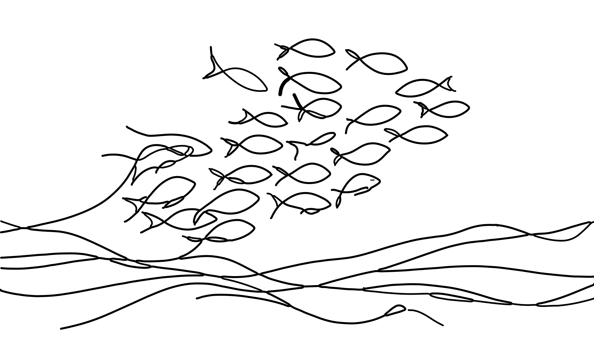

```poetry
G'day!
```

I'm Dan, a Kiwi currently expanding my horizons in the United States. I'm pursuing a Master's in Statistics at the University of Wyoming and am an aspiring data scientist. You can learn more about my journey in the section [[About|A Little About Me]]. Also, you can see a breakdown of this website's content by tags [[tags|here]].

My passion for data science is backed by four years of experience in scientific programming, mathematical, and statistical modeling. I'm known among my peers for my ability in applying a wide range of modeling methodologies and distilling them into concise scientific reports that unveil meaningful insights.

My academic pursuits have been diverse yet focused. I hold a Master’s in Economics, and I'm on the verge of completing my second Master's in Statistics. This strong theoretical foundation has been instrumental in my practical work as a data scientist. My hands-on experience includes roles such as a graduate researcher at the University of Wyoming's Advanced Research Computing Center, an intern bioinformatician at the [Wyoming Public Health Lab](https://github.com/DHintz137/WastewaterSurveillancePoster), and an intern data scientist at Western EcoSystems Technologies.

One of my current exciting projects involves collaborating with the Mayo Clinic and [Argonne National Labs](https://github.com/DHintz137/Cancer_AI_Poster/tree/main). Here, I'm contributing to the development of an AI-driven medical software engine, designed to predict the progression of colorectal cancer in patients. This project forms a part of my thesis work and is a significant step in my data science journey.

Curious about what to expect from my website? Take a look at my article on [[MCMC_from_scratch|Metropolis-Hastings MCMC from Scratch]] ✨. And there's more to come! Stay tuned for upcoming posts on diverse topics like TiDE Time series forecasting in Python, implementing K-means in C++ from scratch, exploring LLMs and the Llama2 API in Python, and crafting visualizations with D3.js.

At the core of my professional life is a deep-seated passion for working alongside domain experts. I enjoy helping them understand and apply the best modeling strategies for their specific challenges. I find this process to hone my own craft from having to apply my knowledge to new problems as well as an inherent richness in learning something new from a domain expert. Sharing knowledge, experiences and collectively overcoming obstacles is, for me, the essence of what makes this field so rewarding.


<!--
see settings at quartz/components/pages/TagContent.tsx
-->

```poetry
Cheers,
Dan
```

<!-- Embed Plotly Chart -->
<!--
<iframe src="https://chart-studio.plotly.com/~dhintz1/1.embed" width="640"
height="480" frameborder="0" allowfullscreen></iframe>
-->
